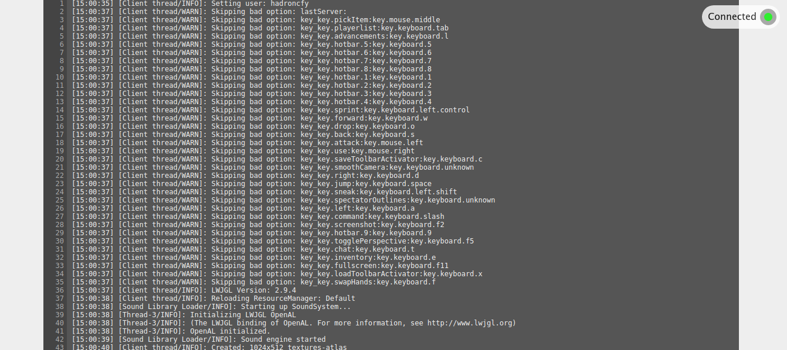

# webmc

[](https://www.npmjs.com/package/webmc)

Display the output of a process in browsers.



## Original purpose
This programme was originally used by me to display Minecraft log text when queueing in [2b2t](2b2t.org), so I could see my position in queue when away from computer, such as when going out for dinner.

## Usage
```js

const createServer = require('webmc');

const server = createServer({
    addr: 'localhost:8080', // server address, used in websocket handshake, port number must be consistent with `port'
    port: 8080, // server port
    decodeMC: true // whether to decode Minecraft color code
});

const childProcess = /* Create a child process, could be Minecraft */;

prc.stdout.on('data', data => server.write(data));

```